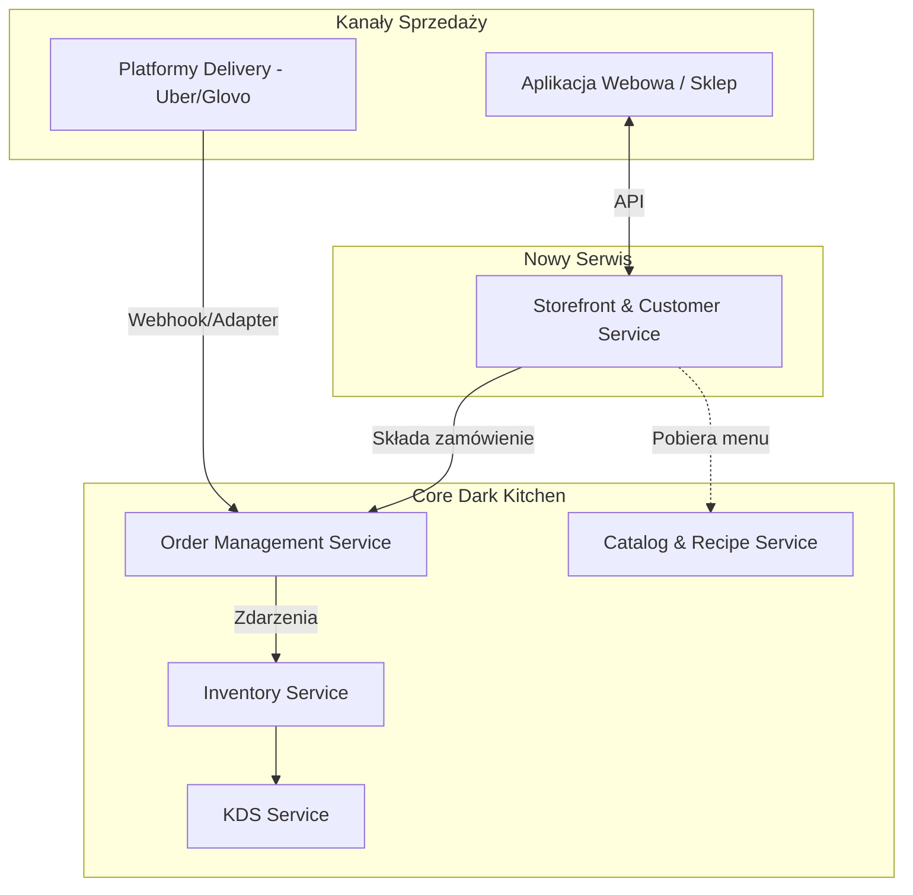

# ADR 007: Pragmatyczna integracja kanału sprzedaży (Storefront Service)

## 1. Status

**Zaakceptowany**

## 2. Kontekst

Wprowadzamy własny kanał sprzedaży (sklep internetowy). Pierwotnie rozważany podział na osobne mikroserwisy (Identity, Payment, BFF) został uznany za zbyt złożony i wprowadzający nieuzasadniony narzut operacyjny na obecnym etapie projektu. Celem jest dodanie funkcjonalności sprzedażowych przy zachowaniu czytelności architektury i uniknięciu "eksplozji" liczby mikroserwisów.

## 3. Decyzja

Decydujemy się na utworzenie **jednego skonsolidowanego mikroserwisu: Storefront Service**.
Będzie on odpowiedzialny za:

1. Zarządzanie danymi klientów i ich uwierzytelnianie (Identity).
2. Procesowanie płatności (jako moduł wewnątrz serwisu).
3. Agregację danych z innych serwisów (np. pobieranie menu z Catalog Service) w celu wystawienia optymalnego API dla aplikacji frontendowej.

## 4. Uzasadnienie

- **Redukcja złożoności:** Zamiast zarządzać czterema nowymi bazami danych i projektami, zarządzamy jednym. Ułatwia to wdrażanie (deployment) i monitoring.
- **Logiczna spójność:** Wszystko, co dotyczy bezpośredniej interakcji z klientem końcowym, znajduje się w jednym miejscu (Boundary Context: Sales).
- **Efektywność nauki:** Pozwala skupić się na integracji sklepu z resztą systemu (Order Service), zamiast na rozwiązywaniu problemów komunikacji między wieloma małymi serwisami pomocniczymi.

## 5. Konsekwencje

### Pozytywne (Zalety):

- Szybszy czas wytwarzania (Time-to-Market) dla funkcjonalności sklepu.
- Mniejsze zużycie zasobów w środowisku .NET Aspire.
- Prostsza orkiestracja transakcji (np. łatwiejsza synchronizacja płatności z danymi klienta).

### Negatywne (Wyzwania i ryzyka):

- **Puchnięcie serwisu (Fat Service):** W miarę dodawania funkcji (np. programy lojalnościowe, zwroty, reklamacje), serwis ten może stać się zbyt duży. Wówczas konieczna będzie jego ponowna dekompozycja.
- **Mniejsza granulacja skalowania:** Nie możemy skalować samej obsługi płatności niezależnie od obsługi profili klientów (zazwyczaj nie jest to problemem na tym etapie).

